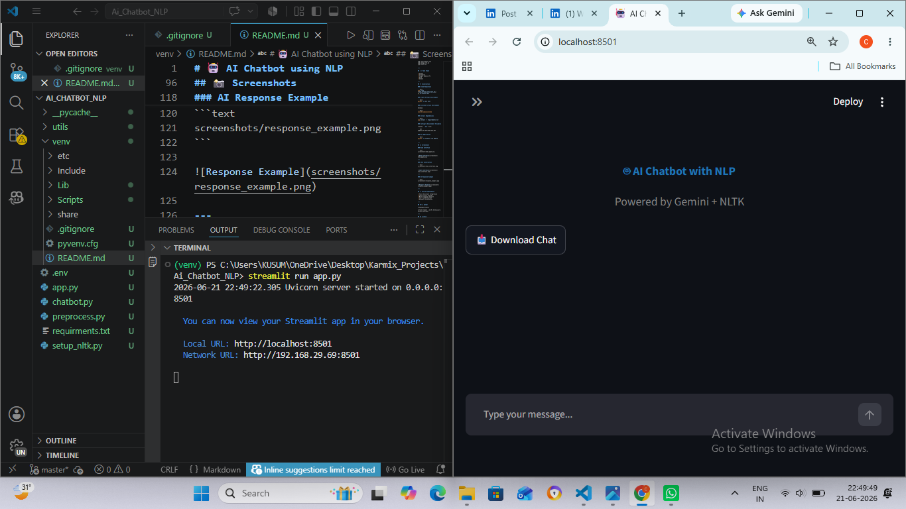
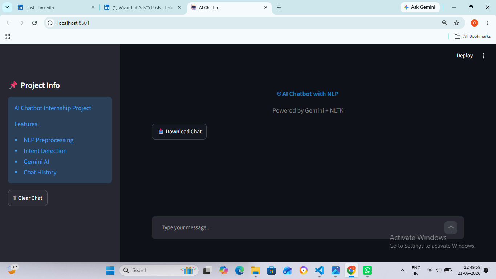
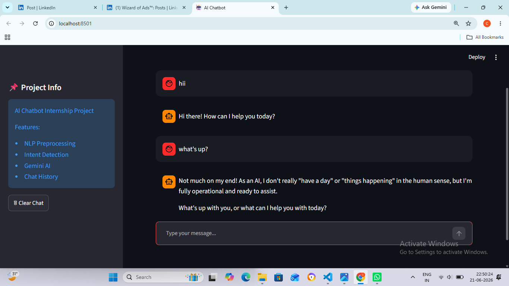
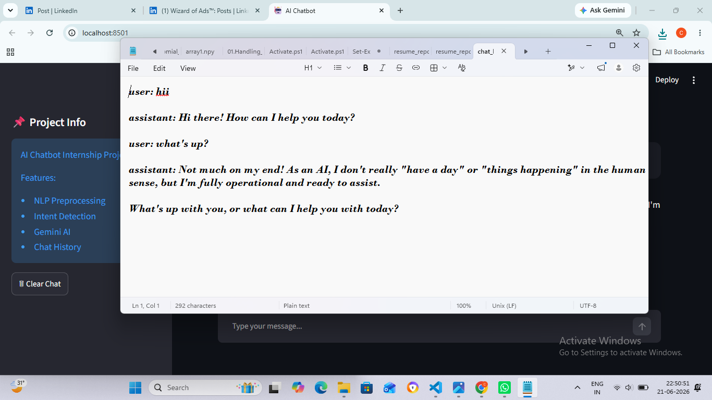

# 🤖 AI Chatbot using NLP

An intelligent chatbot built using Python, Natural Language Processing (NLP), and Google's Gemini API. The chatbot processes user queries, detects intent, and generates context-aware responses through a clean Streamlit web interface.

---

## 🚀 Features

* Interactive Streamlit User Interface
* Natural Language Processing (NLP)
* Intent Detection
* Text Preprocessing
* Gemini AI Integration
* Environment Variable Security
* Modular Code Structure
* Easy Deployment

---

## 📂 Project Structure

```text
Ai_Chatbot_NLP/
│
├── utils/
│   └── intents.py
│
├── venv/
│
├── .env
├── app.py
├── chatbot.py
├── preprocess.py
├── requirements.txt
├── setup_nltk.py
└── README.md
```

---

## 🛠️ Tech Stack

* Python
* Streamlit
* Google Gemini API
* NLTK
* dotenv

---

## 📦 Installation

### Clone Repository

```bash
git clone <https://github.com/Chandan-bt6/Ai_Chatbot_with_NLP.git>
cd Ai_Chatbot_NLP
```

### Create Virtual Environment

```bash
python -m venv venv
```

### Activate Virtual Environment

Windows:

```bash
venv\Scripts\activate
```

### Install Dependencies

```bash
pip install -r requirements.txt
```

### Configure Environment Variables

Create a `.env` file:

```env
GEMINI_API_KEY=YOUR_API_KEY
```

### Run Application

```bash
python -m streamlit run app.py
```

---

## 📸 Screenshots

### Home Interface

```text
screenshots/home_page.png
```



---

### Chat Conversation

```text
screenshots/chat_interface.png
```



---

### AI Response Example

```text
screenshots/response_example.png
```



---

### Chat History

```text
screenshots/chat_history.png
```



---

## 🎯 Future Enhancements

* Voice Assistant Integration
* Chat History Storage
* Multi-language Support
* User Authentication
* Database Integration

---

## 👨‍💻 Author

**Chandan Bisht**

B.Tech Student | AI/ML Enthusiast | Python Developer

---

## 📄 License

This project is developed for educational and learning purposes.
